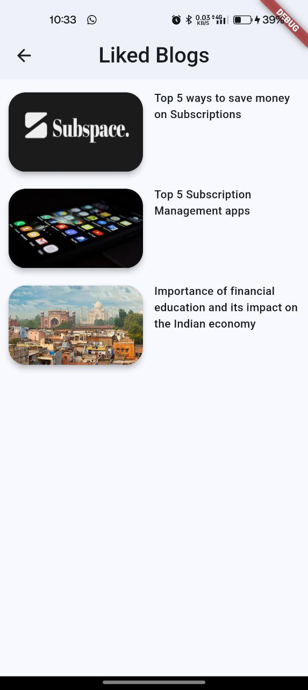
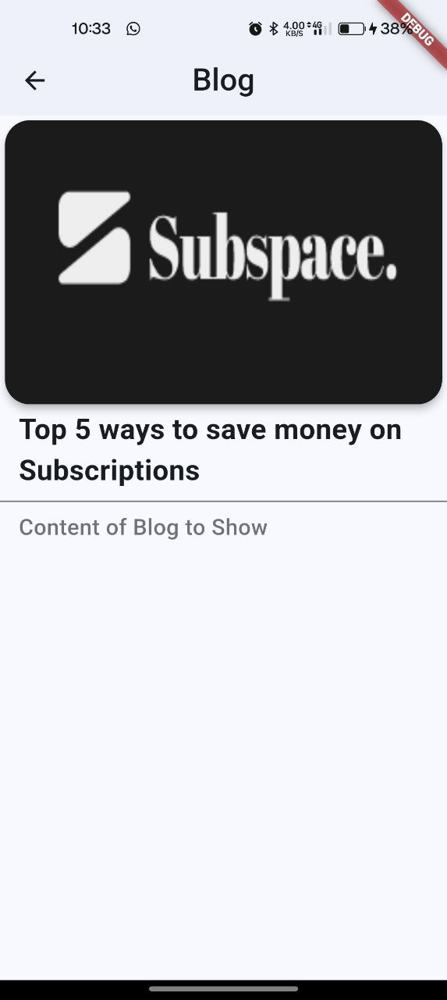
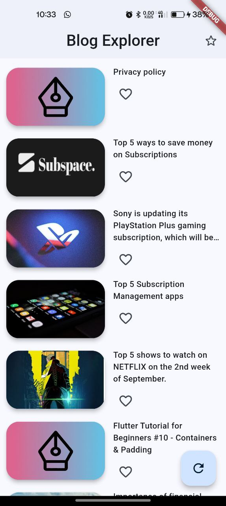
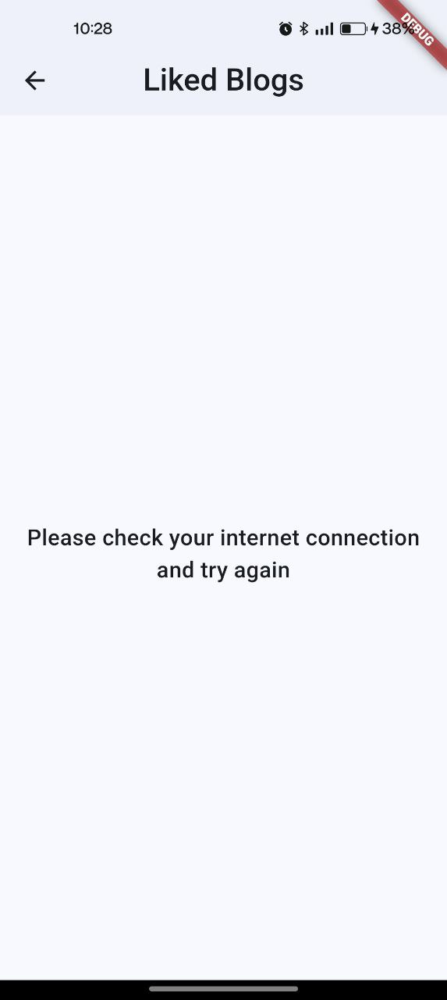

   
   <h1>Blog Explorer - By SubSpace</h1>

 

 

### 🌍 Read Daily Blogs

- **Blog List View**
- **Detailed Blog View**
- **Navigation**
- **Interactive Features**
- **State Management**
- **Error Handling**
- **UI/UX Design**

This application has an aesthetically pleasing design.

---

### How to build and run the app

- clone the repository and open it in android studio
- Run `flutter pub get` to download all packages
- Now, connect a AVD or a real device via wi-fi through developer options
- Then, Run the App and get the desired output

### 🌐 Reliable Data Sources

We fetch blog data from RESTful API.

---

### 📷 Screenshots

|       |       |       |
|-----------------------------------------------|----------------------------------------------| ------------------------------------------- |
|  |  |

---

### 👨🏻‍💻 Connect with me

   

